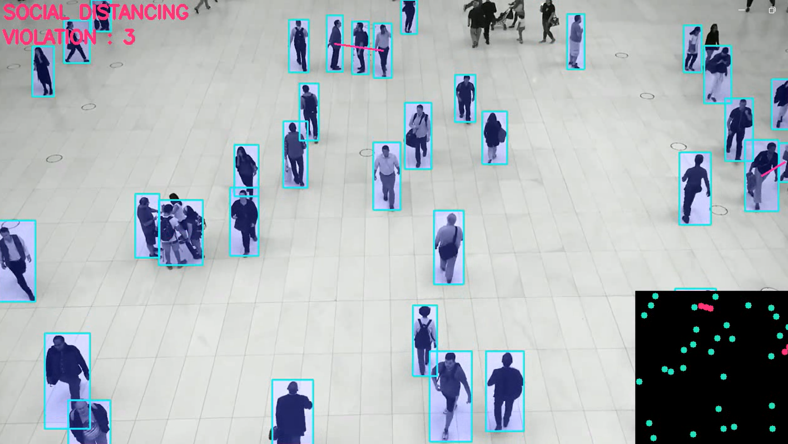

## Social Distancing Monitoring

Monitor social distancing between people, identify high-risk areas and non-compliance.

AI vision systems use Deep neural networks to provide a scalable approach to automatically analyze social distancing measures in the crowd in indoor and outdoor environments :

▪️ Automating social distancing monitoring with surveillance cameras ensures greater consistency and accuracy compared to manual inspections.
▪️ Analyzing the people’s moving trajectories and rate of social distancing violations
▪️ Enhancing the safety of people, workforces, and customers by enforcing social distancing across multiple locations on a large scale.
▪️ Reducing the costs associated with manual inspections while adhering to governmental guidelines.